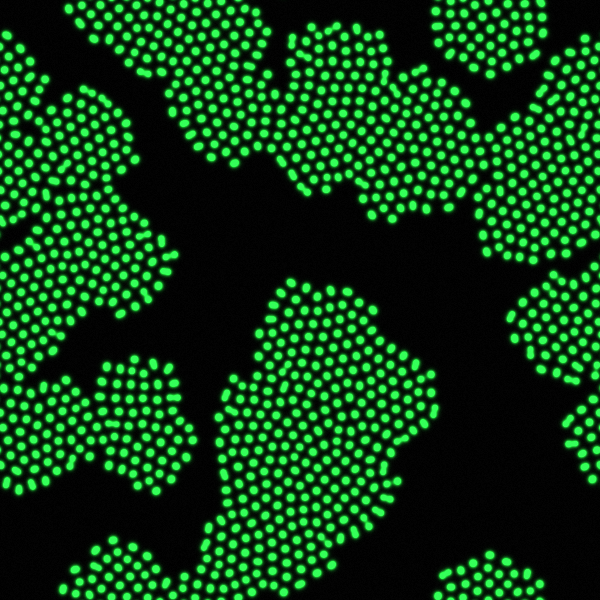

# Gray-Scott Mitosis Simulator

> **TL;DR** — This tool simulates a chemical reaction where green blobs spontaneously grow, divide, and spread across a grid — like cells under a microscope. You give it some parameters (how many blobs, how long, what resolution) and it produces an MP4 video. You can run it as a command-line script, through a browser UI, or in batch mode to render multiple videos at once. It runs inside Docker so there's nothing to install beyond Docker itself.

A reaction-diffusion simulator running the Gray-Scott model in the **mitosis regime** — parameters tuned so blobs spontaneously divide and spread. Output is an MP4 video with a GFP (green fluorescent protein) colormap.

### Why blobs divide

The grid holds two chemicals: **U** (food, shown as black) and **V** (activator, shown as green). Food fills the whole space at the start; the activator is seeded as a handful of small blobs.

Every step, three things happen simultaneously across every cell:

1. **Consumption** — where activator is present, it converts food into more activator (`U + 2V → 3V`). The more activator, the faster it eats.
2. **Replenishment** — fresh food constantly flows in from outside at a fixed feed rate `F`, and activator slowly decays at kill rate `K`.
3. **Diffusion** — both chemicals spread outward, but food diffuses twice as fast as activator (`Du = 2×Dv`).

The blob grows as long as enough food can diffuse in from the surrounding area to sustain it. The critical threshold is a **size limit** imposed by diffusion: once a blob gets large enough, the food supply can no longer reach the centre fast enough to keep up with consumption. The centre starves, the blob elongates, and pinches into two smaller blobs — each small enough to be well-fed again. Those blobs grow, hit the same limit, and divide again.

The specific values `F = 0.0367` and `K = 0.0649` are what place the system in this self-replicating regime. Slightly different values produce completely different behaviour — stable spots, moving stripes, chaotic decay, or a frozen labyrinth. The mitosis regime sits in a narrow band of parameter space where the feed rate is just high enough to sustain growth but the kill rate is high enough to prevent the activator from taking over the whole grid.



---

## How it works

The simulation numerically integrates two coupled partial differential equations on a 2D toroidal grid:

```
∂U/∂t = Du·∇²U  −  U·V²  +  F·(1−U)
∂V/∂t = Dv·∇²V  +  U·V²  −  (F+K)·V
```

- **U** — nutrient concentration (starts at 1.0 everywhere)
- **V** — activator concentration (seeded at N random 7×7 blobs)
- **Du, Dv** — diffusion rates (0.16 / 0.08)
- **F = 0.0367** — feed rate (how fast nutrient replenishes)
- **K = 0.0649** — kill rate (how fast activator decays)

These specific F/K values place the system in the **mitosis regime**: existing blobs grow until they divide in two, producing the characteristic spreading dot pattern.

Each recorded frame is produced by running 8 simulation steps, then mapping V concentration through a GFP colormap (black = no activator, bright green = active blob) and piping raw RGB24 frames directly into ffmpeg.

---

## Quick start

### Requirements

```
pip install numpy flask     # runtime
pip install numba           # optional — ~10-20x JIT speedup
pip install snakemake       # only needed for batch workflow
# ffmpeg must be on PATH
```

### CLI

```bash
python turing_mitosis_mpeg.py
python turing_mitosis_mpeg.py --seeds 15 --fps 15 --duration 30 --out out.mp4
```

### Web UI (Docker)

```bash
docker compose up --build
# open http://localhost:5000
```

### Snakemake batch

```bash
snakemake --cores 4     # run all configs in config.yaml in parallel
snakemake -n            # dry-run
```

---

## CLI reference

| Argument | Default | Description |
|---|---|---|
| `--width` / `--height` | 1080 | Output video dimensions (forced even for H.264) |
| `--duration` | 30.0 | Video length in seconds |
| `--fps` | 15 | Output framerate |
| `--burn_in` | 2000 | Warm-up steps before recording starts |
| `--steps_frame` | 8 | Simulation steps per recorded frame |
| `--seeds` | 15 | Number of starting blobs |
| `--cell_size` | 1 | Blob size multiplier — sim runs at W/N × H/N, output stays W×H |
| `--crf` | 18 | ffmpeg quality (0 = lossless, 18 = high, 23 = default) |
| `--seed` | None | RNG seed for reproducible output |
| `--out` | turing_mitosis_lf.mp4 | Output file path |

#### Cell size

`--cell_size N` runs the simulation on a grid N times smaller than the output resolution, then upscales with nearest-neighbor interpolation. This makes blobs appear N× larger and runs N² times faster.

| `--cell_size` | Sim grid (1080p) | Speed vs 1× |
|---|---|---|
| 1 | 1080×1080 | 1× |
| 2 | 540×540 | ~4× |
| 3 | 360×360 | ~9× |
| 4 | 270×270 | ~16× |

---

## Performance

The hot loop is the Gray-Scott PDE update, called thousands of times per video. Three optimisations are layered:

1. **Numba JIT** (`@njit(parallel=True)`) — computes the laplacian and update inline per cell, parallelised across CPU cores via OpenMP. Install `numba` to enable; the code falls back to NumPy silently if it isn't present. First run triggers a one-time compilation (~2–5 s); subsequent runs use a cached binary.

2. **Optimised laplacian** — replaced 4× `np.roll` (4 full array copies each step) with a single `np.pad` + slicing.

3. **Pre-allocated double buffering** — `step()` takes explicit output buffers and swaps references each iteration, eliminating all heap allocations in the recording loop.

---

## Web UI

The Flask app exposes three endpoints:

| Endpoint | Method | Description |
|---|---|---|
| `/` | GET | Serve the single-page UI |
| `/run` | POST | Start a simulation job; returns `{job_id}` |
| `/status/<id>` | GET | Returns `{status: queued\|running\|done\|error}` |
| `/view/<id>` | GET | Stream the MP4 (for in-browser playback) |
| `/download/<id>` | GET | Download the MP4 as an attachment |

The UI polls `/status` every 3 seconds and displays the video inline once done. Jobs are stored in memory and lost on container restart.

The **Resolution preset** dropdown sets the simulation grid independently of the output resolution:
- **Preview (540×540)** — 4× faster, good for tuning parameters
- **Export (1080×1080)** — full quality
- **Custom** — unlocks the width/height inputs directly

---

## Batch workflow (Snakemake)

`config.yaml` defines named runs. Each run is an independent ffmpeg + simulation job, parallelised by Snakemake across available cores.

```yaml
runs:
  default:
    seeds: 15
    fps: 15
    duration: 30
    width: 1080
    height: 1080
    burn_in: 2000
    steps_frame: 8
    crf: 18
  preview:
    seeds: 10
    duration: 10
    width: 512
    height: 512
    ...
```

```bash
snakemake --cores 4                        # run all
snakemake generated_files/preview.mp4     # single target
snakemake -n                               # dry-run
```

---

## AWS deployment

The app runs as a containerised service on **AWS Elastic Beanstalk**, built and deployed via **AWS CodeBuild**. Elastic Beanstalk itself is free; you only pay for the underlying EC2 instance (free-tier eligible on `t3.micro`).

### First-time setup

```powershell
aws configure           # enter Access Key, Secret, region (e.g. us-east-1), output format
cd aws
.\deploy.ps1 -GitHubRepoUrl https://github.com/you/your-repo -GitHubToken ghp_xxx
```

This creates (idempotent — safe to re-run):
- ECR repository for Docker images
- S3 bucket for Elastic Beanstalk deployment bundles
- EC2 IAM instance profile so EB instances can pull from ECR
- CodeBuild IAM role with ECR, EB, S3, and CloudWatch permissions
- CodeBuild project connected to your GitHub repo via `buildspec.yml`
- Elastic Beanstalk application and `t3.micro` Docker-platform environment (~5 min first run)

### Deploying

```powershell
aws codebuild start-build --project-name cellular-automata --region us-east-1
```

The build (`buildspec.yml`) does:
1. Logs into ECR, builds and pushes the Docker image as `:latest`
2. Generates a `Dockerrun.aws.json` pointing at the new image
3. Uploads a versioned deployment bundle to S3
4. Creates a new EB application version and calls `update-environment` to deploy it

### Pipeline

```
aws codebuild start-build → docker build → ECR push → EB application version → EB deploy
```

---

## Project structure

```
turing_mitosis_mpeg.py     standalone CLI — simulation + ffmpeg pipe
Snakefile                  batch workflow orchestration
config.yaml                named run configurations for Snakemake
requirements.txt           numpy, flask, numba
Dockerfile                 python:3.11-slim + ffmpeg + deps
docker-compose.yml         local Docker run (mounts ./generated_files)
web/
  app.py                   Flask server — job queue, subprocess launcher
  templates/index.html     single-page UI
aws/
  deploy.ps1               one-time AWS infrastructure setup (ECR, IAM, CodeBuild, EB)
buildspec.yml              CodeBuild build steps — docker build, ECR push, EB deploy
generated_files/           output MP4s (git-ignored)
```
